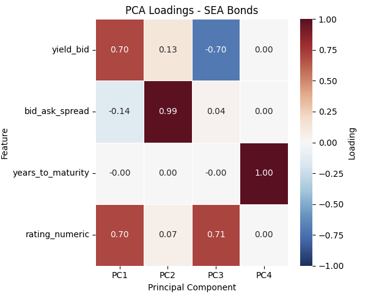

# Southeast Asian (SEA) Fixed Income PCA Pipeline

A quantitative pipeline for extracting Southeast Asian fixed-income securities (Indonesia, Malaysia, Philippines, Singapore, Thailand) via **Bloomberg Query Language (BQL)** and **Bloomberg Quant (BQuant)**, processing market/credit risk metrics, and decomposing cross-sectional variance using Principal Component Analysis (PCA).

---

## PCA Loadings Heatmap

### Factor Interpretation

* **PC1 (Level & Credit Risk):** High positive loadings on `yield_bid` ($0.70$) and `rating_numeric` ($0.70$), capturing baseline yield levels driven by credit quality[cite: 1].
* **PC2 (Liquidity Factor):** Heavily dominated by `bid_ask_spread` ($0.99$), isolating market liquidity and transaction cost dispersion across instruments[cite: 1].
* **PC3 (Credit-Yield Spread):** Divergence between nominal yield ($-0.70$) and rating tier ($+0.71$), isolating credit risk premia relative to nominal yields[cite: 1].
* **PC4 (Tenor / Maturity):** Fully isolated loading on `years_to_maturity` ($1.00$)[cite: 1].

---

## Data Pipeline & Architecture

1. **Universe Extraction (Bloomberg BQL):**
   * Connects via `bql.Service()` to fetch active fixed-income securities across `['ID', 'MY', 'PH', 'SG', 'TH']`[cite: 1].
   * Partitions universe into **Sovereign**, **Quasi-Sovereign**, and **Corporate** sectors using BICS and BCLASS classification rules[cite: 1].
2. **Feature Extraction:**
   * Fetches static metadata (`issue_dt`, `maturity`, `crncy`, `rating`) and 1-year historical bid/ask yield series (`yld_annual_bid`, `yld_annual_ask`)[cite: 1].
   * Maps qualitative credit ratings into an ordinal numeric scale[cite: 1].
3. **Decomposition & Modeling:**
   * Standardizes continuous/ordinal features via `StandardScaler`[cite: 1].
   * Decomposes variance into 4 principal components via `sklearn.decomposition.PCA`[cite: 1].
   * Generates interactive 3D cluster visualizations via `plotly.express` and static loading heatmaps via `seaborn`[cite: 1].
